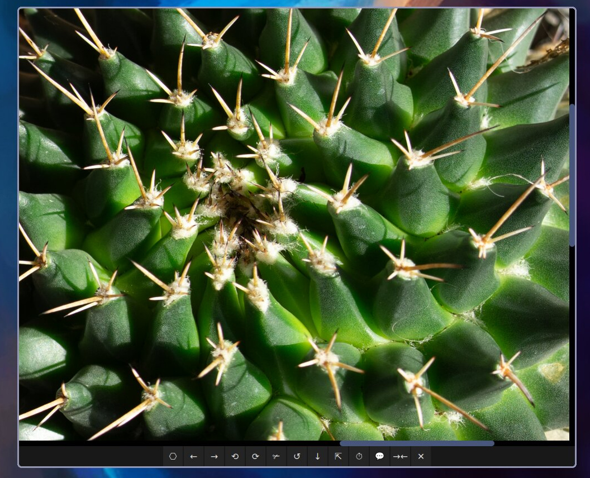

# Why do this?
I tried pretty much all the well known image viewers on Linux & did not really like either of them. Viewnior is ok, but it's still too clunky to do quick edits (crop, rotation) & it doesn't work right on Wayland.
Also many of them are straight up laggy (hello there Gwenview, I don't like you). This applet feels snappy to use, it will always react to left-right arrow keys/spamming no matter how large the images you are browsing are, or at least it should.. Even the fastest computer needs time to load a 100mpx image from a spinning HDD, this vibe coded python monster handles this quite gracefully. Furthermore the app does caching, so if you open an image it will cache the next few in the background, so most of the time in typical use you will not notice any loading time. 



# 🖼️ vibecoded_image_editor_and_quick_edits LLM Generated Usage Guide

A lightweight, keyboard‑driven image viewer built with Python, PyQt6, and Pillow.  
Designed for speed, minimal UI clutter, and quick edits — perfect for browsing, cropping, rotating.

---

## ✨ Features

- 🖱️ **Pan & zoom** – Click‑drag to pan, scroll to zoom. Right‑click to select a crop area.
- 🌀 **Rotate** – 90° left/right, non‑destructive in memory until you save.
- ✂️ **Crop** – Select an area with right‑click, then crop. Saved on write.
- 🔍 **Minify** – Downscale to 1920px on the long edge (great for reducing file size).
- 🎞️ **Slideshow** – Random slideshow with a 5.5s interval.
- 🗑️ **Trash** – Move current image to system trash (via `gio trash`).
- 📊 **OSD notifications** – Feedback for actions (minify, save, crop, etc.).
- ⌨️ **Keyboard shortcuts** – Full keyboard support (see below).

---

## 🖥️ Button Labels (UI)

| Button | Action |
|--------|--------|
| `⎔`   | Open image / folder |
| `←`   | Previous image |
| `→`   | Next image |
| `⟲`   | Rotate left (−90°) |
| `⟳`   | Rotate right (+90°) |
| `✃`   | Crop selected area |
| `↺`   | Reset crop / reload current image |
| `↓`   | Save current image (overwrites original) |
| `⇱`   | Toggle fullscreen |
| `⏱`   | Start / stop slideshow |
| `💬`   | Show image info (resolution + file size) |
| `→←`  | Minify to 1920px long edge |
| `✕`   | Exit |

---

## ⌨️ Keyboard Shortcuts

| Key | Action |
|-----|--------|
| `←` / `→` | Previous / Next image |
| `L` | Rotate left |
| `R` | Rotate right |
| `C` | Crop selected area |
| `S` | Save image |
| `I` | Show image info |
| `M` | Minify image |
| `Space` | Toggle slideshow (if running) / Reset crop (if not) |
| `Enter` / `Return` | Toggle fullscreen |
| `Escape` | Exit fullscreen |
| `Ctrl+H` | Toggle 1:1 actual size ↔ Fit to screen |
| `Delete` | Move current image to trash |
| `Middle‑click` | Toggle fullscreen |
| `Mouse wheel` | Zoom in/out |
| `Left‑click + drag` | Pan (move image) |
| `Right‑click + drag` | Select crop area |

---

## 📦 Dependencies
Disclaimer: I only tested on Arch BTW.

### Arch Derivatives
```bash
sudo pacman -S python python-pillow python-pyqt6
```

### Debian / Ubuntu
```bash
sudo apt install python3 python3-pil python3-pyqt6
```

### macOS (Homebrew)
```bash
brew install python
pip install pillow pyqt6
```

### Windows (pip)
```bash
pip install pillow pyqt6
```

> 💡 You also need `gio` for the trash feature (pre‑installed on GNOME/GTK desktops).  
> On non‑GNOME systems, you can replace `gio trash` with `trash-cli` or `rm` by editing the `trash_current_image` method.

---

## 🚀 Installation

```bash
git clone https://github.com/yourusername/vibecoded-image-viewer.git
cd vibecoded-image-viewer
python vibecoded_image_editor_and_quick_edits.py /path/to/your/image.jpg
```

Or simply run without arguments and use the Open button.

---

## 🖱️ Desktop Integration (File Manager "Open With")

Create a `.desktop` file so you can right‑click images and open them with this viewer.

### 1. Create the desktop entry

```bash
nano ~/.local/share/applications/vibecoded-viewer.desktop
```

### 2. Paste this content

```ini
[Desktop Entry]
Name=Vibecoded Image Viewer
Comment=Lightweight image viewer with quick edits
Exec=python3 /path/to/vibecoded_image_editor_and_quick_edits.py %f
Icon=image-x-generic
Terminal=false
Type=Application
MimeType=image/jpeg;image/png;image/webp;image/bmp;image/gif;image/tiff;image/x-icon;
Categories=Graphics;Viewer;
```

### 3. Make it executable

```bash
chmod +x ~/.local/share/applications/vibecoded-viewer.desktop
```

### 4. Set as default (optional)

Right‑click any image → **Open With** → **Other Application** → select **Vibecoded Image Viewer** and check **"Always use for this file type"**.

---

## 🧠 Notes

- All edits (rotate, crop, minify) happen **in memory** until you press `Save` – the original file is overwritten.
- The viewer **does not require a GPU** – uses CPU rendering.
- Supports common formats: `jpg`, `jpeg`, `png`, `webp`, `bmp`, `gif`, `tiff`, `tif`, `ico`.

---

## 📝 License

MIT — free to use, modify, and distribute.

---

